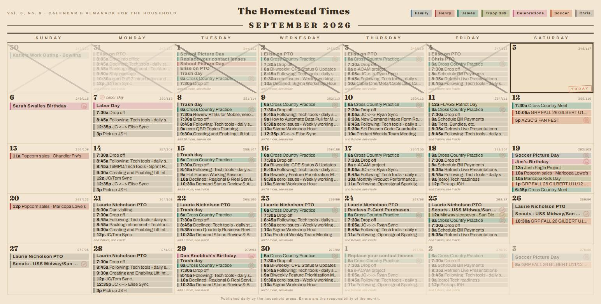

# Homestead Month Card

**The Homestead Times Calendar** — a full-screen newsprint month grid for a wall display, modeled on the household's paper calendar. Companion to the [Almanac Weather Card](https://github.com/LoneWolf345/almanac-weather-card) and the rest of the Homestead Times cards.



**What it prints**

- **A masthead** with the paper's name, volume line, and a highlighter **legend** — one color per calendar, just like the family's marker scheme.
- **The month grid** (Monday first, like the paper original; `week_start: sunday` flips it). **Multi-day events draw as one continuous highlighter bar spanning their days** — lane-aligned across the week, titled once, broken only by the cell rules like a printed calendar. Every cell carries the big Fraunces day number. **Timed events that cross midnight (trips, sleepovers) span days just like all-day ones.**
- **Events as highlighter bars** — translucent color per calendar with a solid left edge; timed events lead with a compact `6:30p`; all-day events print bold; a too-busy day ends with *"and 2 more, see inside."*
- **Rubber stamps** — small eroded-ink stamps (SVG turbulence, no images) beside matching events: 🎂 cake for birthdays, interlocked rings for anniversaries, a struck bell for NO SCHOOL, a soccer ball for games and practices, a plane for trips, a cross for appointments, and a star beside printed holidays.
- **Holidays computed in-card** (US fixed and floating: Labor Day, Thanksgiving, and friends) printed in italics in the cell.
- **Past days struck through in pencil** — the way she crosses them off — and **today boxed in ink** with a tilted TODAY stamp.
- **Tap for the clipping.** Tap any event and a newspaper clipping pins itself over the grid: the calendar's name, the date and time (or the span and its nights), the full title, WHERE, the description as body copy, and the event's rubber stamp pressed in the corner. Tap a day number (or "and 3 more, see inside") for that day in full; tap a legend chip to fade every other calendar for a moment. Tap anywhere or press Esc to close; it fades on its own after `popup_seconds`.

Read-only and data-dense; sizing is vmin-based, so **landscape and portrait both work** — portrait (like the paper calendar) gets taller cells and a higher event cap. Any day with a birthday takes a **big cake stamp** pressed across the cell. Refreshes every 15 minutes and rolls to the new month on its own. **Keyboard paging** for wall boxes without a touchscreen: `←`/`→` (also PgUp/PgDn or `p`/`n`) turn the month, `Home`/`Esc`/`t` return to the present — and after 5 idle minutes off-month it returns by itself (`auto_return` seconds, 0 disables).

## Installation (HACS)

1. HACS → Custom repositories → add this repo, category **Dashboard**
2. Install **Homestead Month Card**
3. Make a dedicated dashboard with a single **panel** view holding this card, and (recommended) [kiosk-mode](https://github.com/NemesisRE/kiosk-mode) to hide the header on the wall device:

```yaml
# dashboard config
kiosk_mode:
  kiosk: true
views:
  - title: Calendar
    panel: true
    cards:
      - type: custom:homestead-month-card
        calendars:
          - { entity: calendar.family,       name: Family,       color: "#5f7e94" }
          - { entity: calendar.henry,        name: Henry,        color: "#a83f39" }
          - { entity: calendar.james,        name: James,        color: "#2f7f6f" }
          - { entity: calendar.troop_389,    name: Troop 389,    color: "#6b7a3f" }
          - { entity: calendar.celebrations, name: Celebrations, color: "#c76b8f" }
          - { entity: calendar.arizona_soccer_club, name: Soccer, color: "#c65f38" }
          - { entity: calendar.chris_work,   name: Chris,        color: "#8a8378" }
```

## Options

| Key | Default | Notes |
|---|---|---|
| `calendars` | required | `[{entity, name, color, stamp?}]` — `stamp` sets a default stamp for every event of that calendar |
| `title`, `subtitle` | `The Homestead Times`, `CALENDAR & ALMANACK FOR THE HOUSEHOLD` | Masthead |
| `show_holidays` | `true` | In-card computed US holidays |
| `strike_past` | `true` | Pencil-X past days |
| `week_start` | `monday` | `monday` or `sunday` |
| `max_events`, `max_events_portrait` | `7`, `13` | Bars per cell before "and N more" (the portrait cap applies automatically when the screen is taller than wide) |
| `height` | `100vh` | The page height (use `calc(100vh - 56px)` if you keep the HA header) |
| `stamps` | `[]` | Extra rules `[{match, stamp}]` tried before the built-ins; stamps: `cake` `rings` `bell` `ball` `plane` `cross` `star` `suitcase` |
| `auto_return` | `300` | Seconds off-month before snapping back to today (0 = never) |
| `tap` | `true` | Tap events, day numbers and legend chips (set `false` for a strictly read-only wall) |
| `popup_seconds` | `20` | How long a clipping stays up before fading on its own (0 = until tapped) |
| `isolate_seconds` | `6` | How long a tapped legend chip keeps the other calendars faded |
| `footer` | house line | Bottom agate |

## Stamp rules (built in)

birthday → `cake` · anniversary → `rings` · no school / breaks → `bell` · soccer / game / practice → `ball` · trip / vacation / camp / flight / arrive / depart → `plane` · visitor / guests / in town → `suitcase` (set `stamp: suitcase` on a Visitors calendar so plain stays get it too) · doctor / dentist / appt → `cross` · printed holidays → `star`.

## Wall hardware

Any Android TV / tablet / Fire device running Fully Kiosk Browser (or the HA Companion app) pointed at the dashboard URL. With kiosk-mode the grid is edge to edge.
